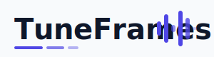

<p align="center">
  <picture>
    <source media="(prefers-color-scheme: dark)" srcset="docs/logo/dark.svg">
    <source media="(prefers-color-scheme: light)" srcset="docs/logo/light.svg">
    
  </picture>
</p>

<p align="center">
  <a href="https://www.npmjs.com/package/tuneframes"></a>
  <a href="https://www.npmjs.com/package/tuneframes"></a>
  <a href="LICENSE"></a>
  <a href="https://nodejs.org"></a>
</p>

<p align="center"><b>Write music in HTML. Render to MP3 with one CLI command.</b></p>

<p align="center">
  
</p>

TuneFrames brings the portability model that made [Hyperframes](https://github.com/Shepherd217/Hyperframes) (97K npm downloads/month) successful — to music. Every AI agent, Claude Code session, and workflow tool can now compose music without native audio code.

---

## Install

```bash
npm install -g tuneframes
```

Or use it directly with `npx` — no install required to try it.

---

## Quick Start

### Option 1: With an AI coding agent (recommended)

Install the TuneFrames skill, then describe what you want:

```bash
npx skills add shepherd217/tuneframes
```

Then describe the music you want:

> "Create a 10-second lofi beat with a D minor chord progression, a simple piano melody, kick and snare, and warm reverb"

The agent scaffolds the project, writes the Tone.js composition, and renders it to MP3.

**Example prompts:**

- *"Make a 30-second ambient track — lush reverb pads, slow arpeggios, D minor, 60 BPM"*
- *"Write a driving techno track — 130 BPM, four-on-the-floor kick, offbeat hi-hats, detuned bass"*
- *"Create a cinematic orchestral piece — strings and brass swell, 72 BPM, 8 bars"*
- *"Generate a 5-second UI sound effect — rising tone with reverb"*

### Option 2: Manual

```bash
npx tuneframes init my-track
cd my-track
# Edit composition.html
tuneframes render composition.html --output my-track.mp3
```

---

## Why TuneFrames?

- **HTML-native** — compositions are HTML files with Tone.js. No React, no proprietary DSL.
- **AI-first** — agents already speak HTML. The CLI is non-interactive by default, designed for agent-driven workflows.
- **Deterministic rendering** — same input = identical output. Built for automated pipelines.
- **Tone.js under the hood** — 814K npm downloads/month. Proven, stable, familiar.
- **Apache 2.0** — fully open source, no per-render fees, no seat caps.

---

## How It Works

Write a `main()` function using Tone.js:

```html
<!DOCTYPE html>
<html>
<head>
  <script src="https://cdnjs.cloudflare.com/ajax/libs/tone/14.8.49/Tone.js"></script>
</head>
<body>
  <div id="tuneframes" style="display:none">{"bpm":120,"duration":"4s"}</div>
  <script>
    async function main() {
      await Tone.start();
      const synth = new Tone.Synth().toDestination();
      synth.triggerAttackRelease('C4', '4n', 0);
      synth.triggerAttackRelease('E4', '4n', Tone.Time('4n').toSeconds());
      synth.triggerAttackRelease('G4', '4n', Tone.Time('4n').toSeconds() * 2);
    }
  </script>
</body>
</html>
```

Render it:

```bash
tuneframes render composition.html --output my-track.mp3
```

---

## Examples

Run any example: `tuneframes render examples/example-<name>.html --output /tmp/<name>.mp3`

| Example | Description | BPM | Duration |
|---------|-------------|-----|----------|
| **minimal** | C major arpeggio — the simplest possible composition | 120 | 2s |
| **lofi** | Chord progression + melody + kick/snare — complete lo-fi hip-hop beat | 80 | 10s |
| **ambient** | Lush reverb pads + delayed crystal arpeggios over D minor | 60 | 4s |
| **orchestral** | Strings, brass, and timpani in a layered 4-bar arrangement | 72 | 4s |
| **techno** | 4-on-the-floor kick, offbeat hi-hats, detuned bass, pad chords | 130 | 4s |

---

## API Reference

### Metadata Block

```html
<div id="tuneframes" style="display:none">{"bpm": 120, "duration": "4s"}</div>
```

- **bpm** — beats per minute (default: 120)
- **duration** — render length in **seconds**. Use `"4s"`, `"10s"`, etc. Not `4n` notation — see note below.

> **Note on duration:** `4n` in Tone.js means "4 quarter notes = 1 whole note" — it is NOT a beat count. At 120 BPM, `4n` = 2 seconds, `2n` = 1 second. Always use literal seconds (`"4s"`, `"10s"`) in the metadata block to avoid clipped renders.

### `main()` Function

Define an async `main()` in a `<script>` tag. TuneFrames waits for it to complete, then renders the offline buffer.

```js
async function main() {
  await Tone.start();
  const synth = new Tone.Synth().toDestination();
  // Schedule all your notes here
}
```

### Instruments

All Tone.js instruments are available:

```js
const synth = new Tone.Synth().toDestination();           // Basic tone
const mono = new Tone.MonoSynth().toDestination();         // Bass, lead
const poly = new Tone.PolySynth(Tone.Synth).toDestination(); // Chords, pads
const kick = new Tone.MembraneSynth().toDestination();     // Kick drums
const noise = new Tone.NoiseSynth().toDestination();       // Hi-hats, snares
```

### Effects

```js
const reverb = new Tone.Reverb({ decay: 2.5, wet: 0.3 }).toDestination();
const delay = new Tone.FeedbackDelay('8n', 0.4).toDestination();
const comp = new Tone.Compressor(-12, 2).toDestination();
const chorus = new Tone.Chorus(4, 2.5, 0.5).toDestination();
```

---

## CLI Reference

```bash
# Render to MP3 (default)
tuneframes render <file.html> [--output <out.mp3>]

# Render to WAV (no re-encoding)
tuneframes render <file.html> --format wav [--output <out.wav>]

# Preview in browser with live reload
tuneframes preview <file.html>

# Scaffold a new project
tuneframes init my-track

# Validate composition (headless render test)
tuneframes validate <file.html>
```

**Requirements:** Node.js >= 18, FFmpeg (`apt install ffmpeg` or `brew install ffmpeg`)

---

## Architecture

```
HTML + Tone.js → Chromium (headless, Tone.Offline)
                → WAV (PCM 44.1kHz mono)
                → FFmpeg
                → MP3 192kbps
```

**Tone.Offline** is the key. It renders without audio hardware or a browser audio context, producing bit-for-bit identical output every time. Same input HTML = same output MP3, guaranteed. This is what makes TuneFrames safe for agents — no randomness, no non-determinism.

---

## TuneFrames vs Hyperframes

Both follow the same portability philosophy. Different domains:

**Hyperframes**
- Output: MP4 video
- Framework: HTML + GSAP
- Use case: video generation, animation

**TuneFrames**
- Output: MP3/WAV audio
- Framework: HTML + Tone.js
- Use case: music composition, sound design

Both are deterministic, open-source, and agent-native.

---

## License

Apache 2.0 — use it in any project, commercial or open-source, no strings attached.

[](LICENSE)